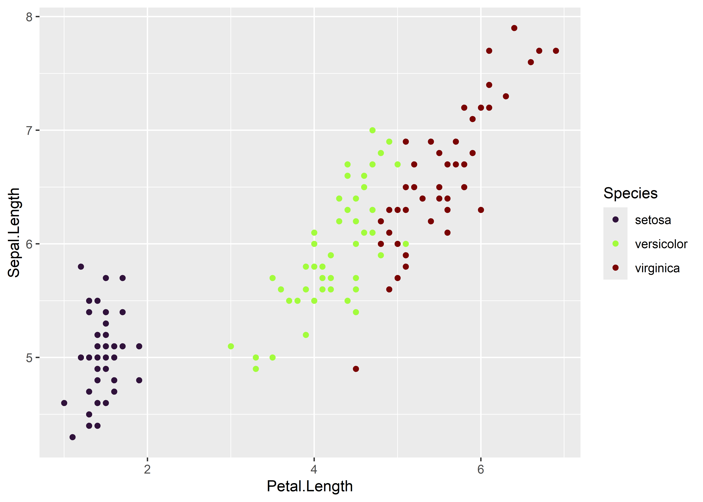
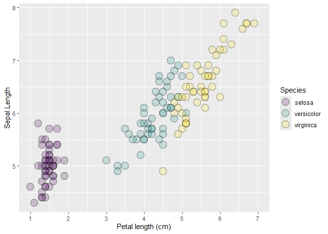
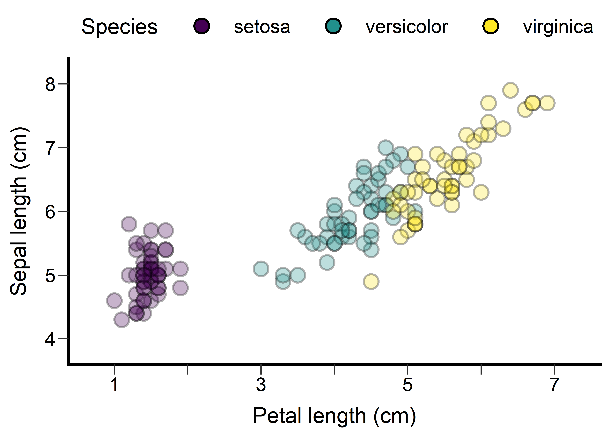
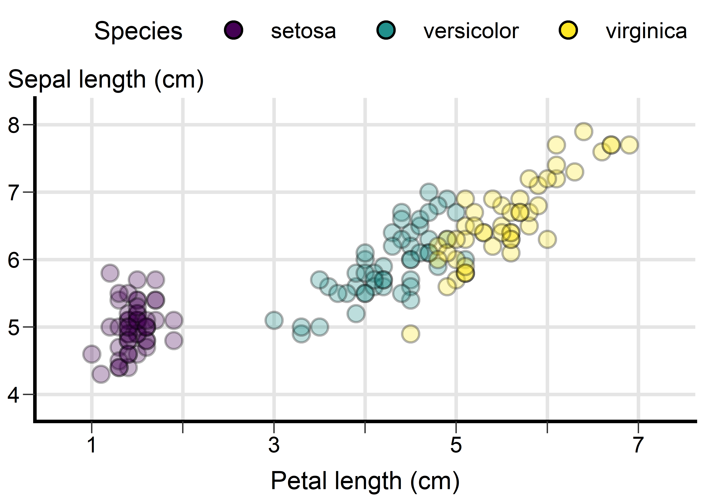

# README
Dr. Alex Bajcz, Quantitative Ecologist, Minnesota Aquatic Invasive
Species Research Center
2025-06-25

## Quick Start Guide

To begin using the `ggplot.plus` package, you’ll first need to install
it from GitHub using the devtools package:

``` r
# install.packages("devtools")  # if not already installed
devtools::install_github("https://github.com/MAISRC/ggplot_plus") #<--NOTE THE _ INSTEAD OF THE . IN THE NAME.
```

Then, load it alongside `ggplot2`:

``` r
# install.packages("ggplot2")  # if not already installed
library(ggplot2)
library(ggplot.plus)
```

Once loaded, you can start layering in the “plus” tools to improve your
plot design with minimal effort.

### Using the tools

Just by loading `ggplot.plus`, you will switch your session’s default
color palette to one that is more broadly accessible–there’s no need to
call `palettes_plus()` to alter this palette unless you want to (see the
“Colorblind-Friendly Palettes” section for details):

``` r
#A BASIC GGPLOT SCATTERPLOT, EXCEPT USING ggplot.plus's DEFAULT COLOR PALETTE INSTEAD.
ggplot(iris, 
       mapping = aes(x = Petal.Length, 
                     y = Sepal.Length)) +
  geom_point(mapping = aes(color = Species))
```


To access the tweaks the package makes to `ggplot2`’s common geometries
(“geoms”), convert your `geom_*()` calls into `geom_plus()` calls,
including the name of the `geom` for the `geom` argument:

``` r
ggplot(iris, 
       mapping = aes(x = Petal.Length, 
                     y = Sepal.Length)) +
  geom_plus(geom = "point", #<--DIFF FUNCTION, NEW GEOM INPUT.
            mapping = aes(color = Species))
```


You can already see that this is a very different graph than what
`ggplot2` would produce by default!

Everything else the package offers gets turned on when you add (using
`ggplot2`’s usual `+` operator) the associated function to your
`ggplot()` command:

``` r
ggplot(iris, 
       mapping = aes(x = Petal.Length, 
                     y = Sepal.Length)) +
  geom_plus(geom = "point", 
            mapping = aes(color = Species)) + 
  theme_plus() + #<-OVERHAULS VISUAL THEME
  scale_x_continuous_plus("Petal length (cm)") +
  #OVERHAULS AXIS BREAKS AND LIMITS (FOR CONTINUOUS AXES ONLY!) 
  scale_y_continuous_plus("Sepal length (cm)") + #<--SAME FOR Y AXIS.
  yaxis_title_plus() + #<--RELOCATES AND RE-ORIENTS Y AXIS TITLE.
  gridlines_plus() + #<--ADDS THOUGHTFUL GRIDLINES, IF YOU *REALLY* WANT THEM.
  labs(color = expression(italic("Iris")*"species")) #<--THIS IS BASE GGPLOT2, BUT A NICE TOUCH!
```


The above graphs demonstrates how `ggplot.plus`’s tools rethink the
default design features of `ggplot2`. The intention is to yield a
cleaner, more accessible, and more modern baseline more quickly so that
you need to spend less time fine-tuning and polishing your graphs for
publication than you might otherwise need to.

However, there’s a *lot* more to know–if you’re interested, keep
reading!

## Motivation

This guide introduces the `ggplot.plus` package—a collection of tools
developed by Dr. Alex Bajcz, Quantitative Ecologist at the Minnesota
Aquatic Invasive Species Research Center (MAISRC) at the University of
Minnesota. These tools are an attempt to provide evidence- and
consensus-based improvements to many of `ggplot2`’s default design
choices.

The guide is neither exhaustive (some features may be omitted) nor
prescriptive (nothing here is “objectively correct”). Instead, it offers
a practical overview of how the tools in this package can enhance
standard `ggplot2` graphics with minimal hassle—even for users with
limited knowledge of `ggplot2`’s inner workings.

At its core, `ggplot.plus` re-imagines the default aesthetics of
`ggplot2`. While a typical one-line `ggplot()` call can yield a
functional graphic, that default output often falls short of modern best
practices in data visualization, including with regards to several
issues of accessibility. As such, many simple `ggplot()` calls do not
immediately yield a graph fit for publication.

Of course, these shortcomings can be addressed using base `ggplot2`
tools like `theme()`, `scale_*()`, and `geom_*()`, but doing so requires
hard-won knowledge of how these tools work and can be tedious to
implement even when you have the knowledge to do so. Plus, even if one
has the technical know-how, not everyone is familiar enough with the
tenets of data visualization to know what to change and how. The
`ggplot.plus` package is designed to help users of all experience levels
start from a more polished and accessible foundation—without sacrificing
`ggplot2`’s immense flexibility to experiment or fine-tune one’s
creations.

Accessibility is a major design goal of the package. Many `ggplot.plus`
defaults are intended to improve compliance with modern accessibility
standards, and this guide will attempt to highlight those cases when
relevant.

**To be clear:** `ggplot.plus` is **not** a replacement for making
careful design choices, artistry, solicitation of feedback, or
understanding your audience’s needs and capabilities. It’s meant to be a
solid launchpad—one that should save you time by starting you in a
well-intentioned design space from which to build upon.

While the design choices baked into these tools ultimate reflect
Dr. Bajcz’s professional judgments, they are grounded in a thorough
review of the last several decades of the data visualization literature,
so it’s key to note that they do not *primarily* reflect his personal
opinions about good graph design (though they also do!).

Without further ado, let’s see the tools contained within this
collection in action!

## Overview of the Package Philosophy

The `ggplot.plus` package is guided by three core principles:

1.  **Better Defaults:**  
    Many default settings in `ggplot2` are functional but sub-optimal in
    terms of design and accessibility. `ggplot.plus` attempts to improve
    upon these—adjusting colors, shapes, gridlines, spacing, text, etc.
    to yield cleaner, more accessible starting visuals.

2.  **Override-ability:**  
    All defaults set by `ggplot.plus`’s tools can be overridden by the
    user, either through standard `ggplot2` syntax or using `_plus`
    variants with arguments. You’re rarely (if ever) stuck with anything
    these tools generate.

3.  **Modularity:**  
    Each tool in `ggplot.plus` is designed to be additive. You can use
    just one of them (e.g., `theme_plus()` or `geom_plus()`) or call all
    relevant ones together (recommended!).

## Key Tools and Their Roles

The package introduces several new functions to add to your base
`ggplot2` arsenal. These include:

| Function | Purpose |
|----|----|
| `geom_plus()` | A general wrapper for geoms with improved default aesthetics |
| `theme_plus()` | A better base theme with improved default settings for size, spacing, legend placement, and much more. |
| `scale_x/y/color/fill_continuous_plus()` | Drop-in replacements for `scale_x/y/color/fill_continuous()` that will attempt to ensure axis breakpoints and limits are appropriate for fully labeling these axes, especially their ends. |
| `yaxis_title_plus()` | A function for relocating the y axis title from its normal, less accessible location and orientation to the top of the graph. |
| `palettes_plus()` | Converts `ggplot2`’s default color palette for `color` and `fill` aesthetics over to `viridis`’s more accessible color palettes for the session. Runs automatically on load. |
| `gridlines_plus()` | Adds subtle gridlines only when and where justified to add the minimal cognitive load to the graph. |

Each of these is discussed in more depth in the sections that follow,
along with examples.

## A Standard `ggplot` for Comparison

Let’s start by creating a simple `ggplot2` plot to use as a reference
point. The code below generates a scatterplot of petal length vs. sepal
length for iris flowers from three species. These data come from the
`iris` dataset, which is automatically included in every installation of
R. Points are colored by species:

``` r
ggplot(iris, #<--THE DATA SET
       mapping = aes(x = Petal.Length, #<--MAPPING OUR AESTHETICS, I.E., SAYING "*THIS* VARIABLE IN THE DATA SET SHOULD USE *THAT* VISUAL CHANNEL IN THE GRAPH". HERE, WE'RE SAYING MAP PETAL LENGTH TO HORIZONTAL POSITION AND SEPAL LENGTH TO VERTICAL POSITION.
           y = Sepal.Length)) +
  geom_point(mapping = aes(color = Species)) #<--WE'LL ALSO MAP COLOR TO DIFFERENT SPECIES.
```


This graph is simple and reasonably effective—perfectly suitable for
exploratory work or informally sharing with colleagues. However, for
presentation or publication, it falls short of several well-established
design and accessibility best practices. Some of the key issues include:

- **Text size**: The default font size for axis and legend text is too
  small for easy reading, especially for those with visual impairments.
  A common rule of thumb is: if the text feels *almost* **too** large to
  you (assuming you have “standard” vision), it’s probably just right.

- **Point size**: The points are also quite small, which can hinder
  readability for some users. The same rule applies here too—data
  elements should be larger than you probably *think* they need to be.

- **Color palette**: `ggplot2`’s default “rainbow” palette lacks
  variance in **luminance** (how “bright” or “dark” the color is). For
  someone who is colorblind (especially red-green colorblind), the red
  and green shades used are difficult to distinguish. For those with no
  color vision at all, or for those using black-and-white viewing
  technologies, all three hues would look *very* similar.

- **Foreground/background contrast**: While **contrast** (the ease with
  which nearby elements can be distinguished from one another on the
  basis of color) between the points and the background here is *ok*, it
  could be improved by using darker point colors and/or a lighter plot
  background. As noted above, it would also be helpful if the different
  color shades used for the points contrasted better with each other
  too. High contrast is critical for accessible and quickly
  interpretable design.

- **Whitespace and layout**: Default `ggplot`s often suffer from cramped
  layouts. In particular, spacing is often tight between:

  - Axis **titles** and the paired axis **labels**

  - Elements within the **legend**

  - Axis labels on densely labeled axes (not an issue here, but often a
    problem)

  Adding more **void space** (space not housing any graphical element)
  between elements helps readers visually parse and process the plot
  more efficiently, especially those with cognitive or visual
  impairments.

- **Axis readability**: In `ggplot2`, axis and legend titles and labels
  will default to the column names/values found in the data set unless
  the user sets custom text for them. These default title/label strings
  are often “computer-y” (e.g., they lack spaces, have unusual
  capitalization, and contain punctuation instead of spaces, etc.)
  rather than designed for human readability or interpretation. Axis
  titles and labels should have standard spelling, spacing, and
  punctuation, and they should be readily human-interpretable and
  contain units, if applicable.

- **Gridlines**: The research on the merits of gridlines is, admittedly,
  mixed in some ways. They:

  - *Can* reduce contrast between themselves, the background, and the
    data elements.

  - Increase **cognitive load** (the amount of mental effort needed to
    integrate the available information and form conclusions) by adding
    visual information to the plotting area.

  - *May* slow down interpretation as they must be parsed from the data
    elements.

  - *May* constitute visual clutter if they are not used by the reader.

  - Are especially unhelpful when included for scales linked to discrete
    data.

  On the flip side, gridlines familiar to novice readers and can help
  with estimating exact values, when this is required. However, most
  experts agree that graphs are **not** the most efficient device for
  conveying exact values anyhow. Text, tables, and sharing of raw data
  files are all superior! The adage to remember is that graphs ought to
  *primarily* be about “vibes!”  
    
  Even when a designer deems gridlines are needed, though, research has
  shown that they can and should be faint and infrequent to minimize
  their costs.

- **Incomplete axis labeling**: Axes should generally include tick marks
  and labels at both ends to align with reader expectations (especially
  those of more novice readers) and to aid in efficient comprehension.
  Axes are essentially “number lines,” and they should be consistently
  and completely graduated by labels, just like number lines are. On the
  sample graph above, both axes are missing one or more labels near
  their tips, which makes these axes feel visually “unfinished.”

- **Overplotting**: When data elements partially or wholly overlap, it
  becomes hard to judge how many elements are present in a location.
  This limits the reader’s ability to interpret data **density**.

- **Vertical y-axis title**: Text rotated from horizontal (0 degrees) is
  harder to read and less accessible—especially for dyslexics,
  non-native readers of the language, users with motor or visual
  impairments, and those with certain technological limitations, among
  others. Despite these facts, the y axis title is almost always rotated
  90 degrees from horizontal in scientific graphs. The y axis title is
  also less prominent when placed in the left margin, where it defaults
  to in `ggplot2`. Since many graphs are “about” the y-axis variable at
  a conceptual level, the y axis title likely deserves a more prominent
  location so that readers will encounter it earlier.

- **Tick marks**: The **tick marks** on the axes are small and easily
  lost. More prominent ticks improve usability and help distinguish axes
  from data elements within the plotting region.

- **No axis lines**: To better visually represent “number lines,” and to
  demarcate the boundary between the plotting area and the axis areas,
  most graphs feature axis lines. However, `ggplot2` graphs lack such
  lines by default.

- **Legend placement**: `ggplot2`’s default legend location (in the
  right-hand margin) is space-inefficient. Plus, because most readers
  scan left to right, top-to-bottom, the legend is often not seen early
  on by most readers, making it more difficult to integrate its contents
  with the rest of the plot. Design experts suggest that legend
  information should either be integrated into the plot directly (e.g.,
  through direct labeling inside the plotting area) or else the legend
  should be placed somewhere where it can be more prominent and compact.

This list isn’t an exhaustive list of the design aspects of this graph
that someone *might* object to on some grounds or another, but it
illustrates how even a simple `ggplot` often requires many tweaks to
meet accessibility, clarity, and design standards to bring it up to
publication quality. Not everyone has the time, patience, or wherewithal
to do that work, hence why we built the `ggplot.plus` package.

## Colorblind-Friendly Palettes

We noted above that the default color palette used by `ggplot2` is not
as accessible as it could be. Fortunately, the `viridis` package—bundled
with `ggplot2`—includes several broadly accessible palette options.
These palettes vary not just in **hue** (i.e., the base “color” like
red, green, or blue), but also in **luminance** (light vs. dark). This
multidimensional variance makes the colors in these palettes more
distinguishable from one another across a range of visual impairments
and viewing conditions.

The `ggplot.plus` package includes a convenience function,
`palettes_plus()`, that run automatically on package load. It activates
carefully chosen default palettes for whenever the `color` or `fill`
aesthetics are used by your plots:

``` r
#SAME GRAPH AS BEFORE, THIS TIME WITH palettes_plus() ON
ggplot(iris,
       mapping = aes(x = Petal.Length, 
           y = Sepal.Length)) +
  geom_point(mapping = aes(color = Species))
```


This function uses the titular `viridis` palette for discrete variables
and the `cividis` palette for continuous variables. By default,
`viridis` spans from dark purple to light yellow, passing through blue,
green, and teal. This relatively large number of hues makes it easier to
find SEVERAL discrete hues that are visually distinct from each other
and from whatever background color you use.  
  
However, `palettes_plus()` excludes, by default, both the darkest purple
and the lightest yellow regions of the `viridis` palette because these
shades can lack contrast against elements that are black and white,
respectively. As a result, the remaining palette centers the
blue/teal/green region of the palette to maintain both accessibility and
visual appeal in most contexts.

However, you can easily adjust this behavior using the `begin_discrete`
and `end_discrete` parameters, which range from 0 to 1:

- `begin_discrete = 0` would enable the dark purple portion of the color
  range.

- `end_discrete = 1` would enable the light yellow portion.

``` r
palettes_plus(begin_discrete = 0) #<--ALLOW DARK PURPLE RANGE. CALL THIS FUNCTION ONLY WHENEVER YOU WANT TO CHANGE ITS BEHAVIORS.

#SAME GRAPH AS BEFORE
ggplot(iris,
       mapping = aes(x = Petal.Length, 
           y = Sepal.Length)) +
  geom_point(mapping = aes(color = Species))
```


In this example, we’ve re-enabled the purple end of the palette. This
color contrasts well against the light background, unlike the light
yellow, which would be harder to distinguish from the gray background
here.

### Continuous color scales

To see what the color palette looks like for continuous variables, let’s
temporarily map color to a numeric variable in the data set instead:

``` r
ggplot(iris,
       mapping = aes(x = Petal.Length, 
           y = Sepal.Length)) +
  geom_point(mapping = aes(color = Petal.Width)) #<--MAP COLOR TO A CONTINUOUS VARIABLE INSTEAD.
```


In contrast to `viridis`, the `cividis` palette has essentially just
three hues: blue, gray, and yellow. Because humans like to “chunk” data
into discrete groups by hue, this palette’s low number of distinct hues
will result in fewer false segmentations of the underlying data, even
compared to other accessible palettes. After all, blue, gray, and yellow
points here *are* quite different, so the hue differences many will
perceive here map accurately to differences in the underlying data,
which isn’t always true when many hues are used.

### Other Palette Options

`viridis` AND `cividis` aren’t your only options for palettes. You can
choose from eight palettes, labeled “A” through “H”:

- **A** = magma

- **B** = inferno

- **C** = plasma

- **D** = viridis (default for discrete variables)

- **E** = cividis (default for continuous variables)

- **F** = rocket

- **G** = mako

- **H** = turbo

If you want a more vibrant “rainbow-like” palette that’s still
relatively accessible, *turbo* (“H”) is a good choice:

``` r
palettes_plus(begin_discrete = 0, 
              end_discrete = 1, 
              palette_discrete = "H") #<--SWITCH TO TURBO PALETTE, ACROSS ITS FULL RANGE. 

#SAME GRAPH
ggplot(iris,
       mapping = aes(x = Petal.Length, 
           y = Sepal.Length)) +
  geom_point(mapping = aes(color = Species))
```



Notice that *turbo* has two dark regions (near both 0 and 1), so colors
from these regions may be indistinguishable from each other for users
with total or partial colorblindness or limited viewing technology. To
mitigate this, you can trim one half of the palette using a `begin_*` or
`end_*` value around 0.5 to include only the palette’s “red” or “blue”
side.

### Using `palettes_plus()`

`palettes_plus()` is called automatically when the package is loaded. It
sets the default color and fill palettes globally for all `ggplot2`
plots thereafter. It needn’t be called again unless you want to change
something. For example, let’s change the palette for discrete variables
to a modified *viridis*, one with the darkest shades removed:

``` r
palettes_plus(begin_discrete = 0.28,
              end_discrete = 1, 
              palette_discrete = "D") #<--SET TO VIRIDIS, BUT DON'T INCLUDE THE DARK REGION.
```

This gives us a graph that includes light yellow points, which will have
poor contrast against the light gray background—that’s something we’ll
fix in the later section on theming.

``` r
#SAME GRAPH
ggplot(iris,
       mapping = aes(x = Petal.Length, 
           y = Sepal.Length)) +
  geom_point(mapping = aes(color = Species))
```


## Geometries with Improved Defaults

One of the core tools in `ggplot.plus` is `geom_plus()`. This function
is designed to replace most of the standard `geom_*()` function calls
you’d typically use in a `ggplot2` pipeline.

It has one required argument: `geom`, which should be either the first
argument provided or explicitly named. The required value should
correspond to the portion *after* the underscore in the name of the
`geom_*()` function from `ggplot2` you’d otherwise call. For example:

- `"point"` for `geom_point()`

- `"line"` for `geom_line()`

- `"bar"` for `geom_bar()`,

And so on.

So, to recreate our scatterplot using `geom_plus()`, we simply swap out
`geom_point()` with `geom_plus(geom = "point")`:

``` r
ggplot(iris,
       mapping = aes(x = Petal.Length, 
           y = Sepal.Length)) +
  geom_plus(geom = "point", #<--NEW FUNCTION, NEW GEOM INPUT.
            mapping = aes(color = Species))
```


The primary purpose of `geom_plus()` is to apply improved default
parameters that will hopefully address common design concerns—especially
those related to accessibility. In this example:

- The points are made **larger** and thus easier to parse.

- The default **shape** changes from 16 to **21**.

This latter change is important because shape 16 only uses the `color`
aesthetic whereas shape 21 supports **both** `color` (for the
stroke/outline) and `fill` (for the interior). This gives us more
flexibility in design.

By default, `geom_plus()` will set the interior color for these points
to `"transparent"`, resulting in **hollow circles**. This allows
**partial overlaps** between points to be visually
distinguishable—though, of course, total overlap is still not
discernible. We’ll present some ideas for fixing that later on.

### Improving Contrast with the Fill Aesthetic

If we switch from mapping species to `color` to instead mapping it to
`fill`, `geom_plus()` will switch to using a black stroke color by
default. This fixes the earlier issue of light yellow points lacking
sufficient contrast against the light gray background:

``` r
ggplot(iris,
       mapping = aes(x = Petal.Length, 
           y = Sepal.Length)) +
  geom_plus(geom = "point", 
            mapping = aes(fill = Species)) #<--CHANGED TO FILL AESTHETIC
```


Because the fill colors are now surrounded by **black outlines**, our
eyes will compare the fill color to the black directly next to it rather
than to the background, resolving the contrast issue.

Even though dark purple can’t be distinguished from a black point
stroke, that’s not actually a problem because the point strokes aren’t
encoding any information here. As a result, if we wanted more color
options, we could restore the full range of the *viridis* palette:

``` r
palettes_plus(begin_discrete = 0, end_discrete = 1) #<--RESTORE PURPLE END OF COLOR RANGE AND RETAIN YELLOW RANGE.

#SAME GRAPH
ggplot(iris,
       mapping = aes(x = Petal.Length, 
           y = Sepal.Length)) +
  geom_plus(geom = "point", 
            mapping = aes(fill = Species))
```


Purple points still look purple here, whether we can distinguish their
black outlines from their fill colors here or not. Meanwhile, all points
are easily distinguished from the background, so we can utilize the
entire color space of the palette this way!

### Resolving overplotting

There are two broadly effective options for addressing overplotting in
graphs like this one:

1.  **Transparent fill + stroke color**

- Map the discrete variable (e.g., `Species`) to `color`.

- Use a transparent fill and dark stroke colors for contrast against
  light backgrounds.

- Advantage: Partially overlapping points are visually distinguishable
  due to the hollow centers.

2.  **Dark stroke + colored fill**

- Map the discrete variable to `fill`.

- Use a consistent dark stroke to improve contrast between fill and
  background.

- Advantage: Strong contrast, especially on light backgrounds.

In the latter case, overplotting will still be an issue without one more
tweak: We can make the points *semi-transparent* so that points that
stack on top of one another “bleed through” each other and result in a
darker region (colors will “blend” as well, if applicable):

``` r
ggplot(iris,
       mapping = aes(x = Petal.Length, 
           y = Sepal.Length)) +
  geom_plus(geom = "point", 
            mapping = aes(fill = Species),
            alpha = 0.3) #<--MAKE POINTS SEMI-TRANSPARENT. 0 IS TOTALLY CLEAR, 1 IS TOTALLY OPAQUE.
```


At `alpha = 0.3`, points remain sufficiently visible but points in dense
regions layer on top of each other and result in darker colors,
indicating density.

Note: This approach also dims the **black point strokes**, so contrast
could still be a concern for low-vision readers. Always consider the
balance between legibility and density encoding. If you can’t strike a
good balance, consider whether a scatterplot is the best way to
represent your data!

### Detour: Mapping Visual Channels in `ggplot2` (a Review)

In `ggplot2`, you can control the visual appearance of your graph using
**aesthetics**, which connect **visual channels** (like position, color,
size, or fill) to either variables variables in your data set or to
fixed values.

There are three (partially overlapping) ways to assign aesthetics:

1.  **Global mapping**: Inside `aes()` in the main `ggplot()` call.
    These mappings apply to *all* layers (geoms) by default.

2.  **Local mapping**: Inside `aes()` within a specific `geom_*()`
    function. These *only* apply to the one layer they are included
    within.

3.  **Constant values**: Set inside or outside `aes()` within a geom or
    inside of `aes()` within `ggplot()`. These are fixed values, like
    setting all colors to “red,” that will override any mapping at or
    above their same level.

This system gives you flexibility, but it can be confusing—especially
for new users. Let’s clarify with an example that uses two geoms: a
boxplot overlaid with **jittered** points (jittering randomly shuffles a
point’s location data):

``` r
#NEW PLOT
ggplot(iris,
       mapping = aes(x = Species, #<--NOW, SPECIES, A DISCRETE VARIABLE 
           y = Sepal.Length)) +
  geom_plus(geom = "boxplot") + #<--A NEW GEOM OF BOXPLOT
  geom_plus(geom = "jitter", #<--SAME POINTS AS BEFORE EXCEPT JITTERED.
            mapping = aes(fill = Species),
            alpha = 0.3)
```


Here’s what’s happening:

- **Global mappings** of `x = Species` and `y = Sepal.Length` apply to
  *both* the boxplot and the jittered points.

- The **fill aesthetic** is mapped to `Species`, but **only locally**
  within the jittered points layer, so the boxplot is unaffected.

- The **alpha aesthetic** is set to a constant (0.3), again **only
  locally** for the jittered points. This means all points get this
  value, regardless of what values they have for variables in your data
  set.

If you map the *same aesthetic* in multiple places (e.g., globally and
locally), the **local mapping always wins**—it overrides any global
specification for that layer. Also, if you try to map an aesthetic to
both a variable *and* a constant, the constant usually takes precedence.

### How This Applies to `ggplot.plus`

We bring all this up mostly just to say that all of the same rules apply
when using `ggplot.plus` tools. You can:

- Map aesthetics globally or locally.

- Map aesthetics to variables in your data set or to constant values.

- Combine the approaches as needed–conflicts will resolve as they
  normally do in `ggplot2`.

Here’s a similar plot with a few tweaks to illustrate this further:

``` r
ggplot(iris,
       mapping = aes(x = Species, 
           y = Sepal.Length, 
           fill = Species, #<-- WE CAN SWITCH TO MAPPING FILL GLOBALLY SO IT APPLIES TO BOTH GEOMS. 
           color = Petal.Length)) + #<--NOW ALSO MAPPING COLOR
  geom_plus(geom = "boxplot", color = "blue") + #<--WE LOCALLY OVERRIDE COLOR, SO IT'LL BE BLUE FOR ALL BOXES INSTEAD OF LINKED TO PETAL.LENGTH 
  geom_plus(geom = "jitter") #<--WE NO LONGER MAP FILL LOCALLY OR SET ALPHA TO A CONSTANT.
```


In this version:

- **Fill** is now applied to *both* geoms, since it’s mapped globally.

- **Color** is also mapped globally but overridden locally in the
  boxplot layer (so boxplot outlines are blue, regardless of
  `Petal.Length`).

### Geom Availability

Many common base geoms are already implemented in `geom_plus()`. To see
a list of those currently available, run:

``` r
sort(names(geom_plus_defaults))
```

     [1] "abline"     "area"       "bar"        "boxplot"    "col"       
     [6] "count"      "crossbar"   "curve"      "density"    "dotplot"   
    [11] "errorbar"   "freqpoly"   "histogram"  "hline"      "jitter"    
    [16] "line"       "linerange"  "point"      "pointrange" "ribbon"    
    [21] "segment"    "smooth"     "violin"     "vline"     

If you’d like to see additional geoms supported, you can request them
using the Issues feature on the package’s Github page. However, we tried
to implement all the most commonly used geoms that we felt we could
improve on the defaults of already.

## Improving Axes Breaks and Labels

Let’s return to our earlier scatterplot:

``` r
ggplot(iris,
       mapping = aes(x = Petal.Length, 
           y = Sepal.Length)) +
  geom_plus(geom = "point", 
            mapping = aes(fill = Species),
            alpha = 0.3)
```


There’s still room for improvement, including with the axis titles and
labels. A key first step is to make the axis titles more human-readable,
intuitive, and complete by including units. You can do this using the
`scale_*_*()` family of functions in `ggplot2`:

``` r
ggplot(iris,
       mapping = aes(x = Petal.Length, 
           y = Sepal.Length)) +
  geom_plus(geom = "point", 
            mapping = aes(fill = Species),
            alpha = 0.3) +
  scale_x_continuous(name = "Petal length (cm)") #<-- THE STANDARD WAY TO CHANGE THE X AXIS TITLE FOR A NUMERIC VARIABLE.
```


This works, but the x-axis still lacks labels near its endpoints—a
common issue with `ggplot2`’s default breaks determination process. How
close are the purple points to 0? The yellow points to 8? It’s hard to
tell without anchors on both sides to guide you. You can fix this using
`scale_x_continuous_plus()`, which automatically adjusts breaks and
limits to ensure label coverage near the ends of the axis scale:

``` r
ggplot(iris,
       mapping = aes(x = Petal.Length, 
           y = Sepal.Length)) +
  geom_plus(geom = "point", 
            mapping = aes(fill = Species),
            alpha = 0.3) +
  scale_x_continuous_plus(name = "Petal length (cm)") #<--SWITCH TO PLUS
```



The axis is now expanded to start with a break at 1 and an end break at
7, with breaks in between still chosen to be regular and “pretty,” as in
`ggplot2`.

As with the base `scale` function, you can pass arguments like `name`,
`expand`, `transform`, or `labels` to the `_plus()` version. However,
you *cannot* manually set `breaks` or `limits`, since those are managed
internally by the function. If you want to specify those yourself, use
the base `scale_x_continuous()` instead.

If the resulting labels feel a little too frequent, here’s a trick: You
can suppress some of them by setting custom label text—for instance,
removing every other label using empty strings (`""`) while keeping the
tick marks in those spots:

``` r
ggplot(iris,
       mapping = aes(x = Petal.Length, 
           y = Sepal.Length)) +
  geom_plus(geom = "point", 
            mapping = aes(fill = Species),
            alpha = 0.3) +
  scale_x_continuous_plus(name = "Petal length (cm)", 
                          labels = c(1, "", 3, "", 5, "", 7)) #<--SPECIFYING A VECTOR OF CUSTOM LABELS THAT INCLUDES EMPTY STRINGS FOR EVERY OTHER VALUE
```


This reduces cognitive load and increases void space while preserving
the visual scaffolding the ticks provide. Optional, but a nice touch!

There’s a matching function for the y-axis:

``` r
ggplot(iris,
       mapping = aes(x = Petal.Length, 
           y = Sepal.Length)) +
  geom_plus(geom = "point", 
            mapping = aes(fill = Species),
            alpha = 0.3) +
  scale_x_continuous_plus(name = "Petal length (cm)", 
                          labels = c(1, "", 3, "", 5, "", 7)) +
  scale_y_continuous_plus(name = "Sepal length (cm)") #<--ADDED Y EQUIVALENT.
```


Here, the y-axis expands downward to include a break at 4, making the
axis appear more complete and aiding interpretation.

There are also functions for `fill` and `color` for when these are
mapped to continuous variables: `scale_fill_continuous_plus()` and
`scale_color_continuous_plus()`. But we’ll see those in the next
section.

## Improving the Theme

Much of `ggplot2`’s visual styling is governed by the `theme()`
function, which controls over 100 parameters affecting how a plot looks
and feels. That flexibility is powerful—but also overwhelming for
beginners.

To help with this, `ggplot.plus` includes `theme_plus()`, a custom
version of `ggplot2`’s `theme()` function that overrides many of
`ggplot2`’s default theme settings to be more publication- and
accessibility-minded:

``` r
ggplot(iris,
       mapping = aes(x = Petal.Length, 
           y = Sepal.Length)) +
  geom_plus(geom = "point", 
            mapping = aes(fill = Species),
            alpha = 0.3) +
  scale_x_continuous_plus(name = "Petal length (cm)", 
                          labels = c(1, "", 3, "", 5, "", 7)) +
  scale_y_continuous_plus(name = "Sepal length (cm)") + 
  theme_plus() #<--ADD PLUS THEME TO OVERRIDE THE DEFAULT.
```



This version of the theme makes a number of adjustments to the graph’s
visual design:

- **Larger text** for better readability.

- **Increased spacing** between key elements (like legend keys and axis
  titles and their labels).

- **Thicker axis ticks** for greater visibility and easier
  distinguishing from data elements and axis lines.

- **Removes gridlines** by default (but see next section for how to
  selectively reintroduce them).

- **White background** for highest contrast against most foreground
  elements (though note that a lot of whitespace can increase eye strain
  over prolonged viewing).

- **Black axis lines** at the bottom and left for visual anchoring (but
  no top or right borders, which typically carry no data and thus are
  usually extraneous).

- **Legend moved above the plot** as a horizontal strip, which is more
  space-efficient and increases the likelihood it will be encountered
  early on by readers.

- **All text rendered in black**, rather than the default dark gray for
  some elements, to maximize contrast.

Of course, everything is still customizable. If you don’t love a
particular choice—say, the thickness of the axis lines or the legend’s
location—you can adjust them, same as you normally would:

``` r
ggplot(iris,
       mapping = aes(x = Petal.Length, 
           y = Sepal.Length)) +
  geom_plus(geom = "point", 
            mapping = aes(fill = Species),
            alpha = 0.3) +
  scale_x_continuous_plus(name = "Petal length (cm)", 
                          labels = c(1, "", 3, "", 5, "", 7)) +
  scale_y_continuous_plus(name = "Sepal length (cm)") + 
  theme_plus(axis.line = element_line(linewidth = 0.75)) #<--WE CAN MAKE THE AXIS LINES A LITTLE THINNER IF WE WANT. DEFAULT = 1.2
```


Here’s how you’d relocate the legend to its normal position. But, if you
do this, I’d adjust some of its spacing settings also, as the defaults
are built for horizontal rather than vertical orientation:

``` r
ggplot(iris,
       mapping = aes(x = Petal.Length, 
           y = Sepal.Length)) +
  geom_plus(geom = "point", 
            mapping = aes(fill = Species),
            alpha = 0.3) +
  scale_x_continuous_plus(name = "Petal length (cm)", 
                          labels = c(1, "", 3, "", 5, "", 7)) +
  scale_y_continuous_plus(name = "Sepal length (cm)") + 
  theme_plus(legend_pos = FALSE) #<--ANY VALUE OTHER THAN THE DEFAULT "top" RESTORES ENSURES RIGHT-HAND LEGEND. 
```


Personally, I don’t really like this…it feels a bit wasteful in terms of
space. But if you like it, that’s ultimately what matters! Like the rest
of the `ggplot.plus` toolkit, `theme_plus()` is meant to be a smart
starting point, **not** a “final destination.” Its outputs won’t be
ideal for every plot, person, or context (I don’t think that’s even
remotely possible!), but it’s designed to save you time by making it so
there are at least *fewer* adjustments you need to make to get your
graphs up to modern design standards.

There are a few theme considerations that apply only to color bars,
which are the legend components you see when you map `color` or `fill`
to a continuous variable. Let’s map a continuous variable to `fill` to
get such a legend:

``` r
ggplot(iris,
       mapping = aes(x = Petal.Length, 
           y = Sepal.Length)) +
  geom_plus(geom = "point", 
            mapping = aes(fill = Petal.Width), #<--MAP A CONTINUOUS VARIABLE.
            alpha = 0.3) +
  scale_x_continuous_plus(name = "Petal length (cm)", 
                          labels = c(1, "", 3, "", 5, "", 7)) +
  scale_y_continuous_plus(name = "Sepal length (cm)") + 
  theme_plus()
```


The changes here include longer and fatter tick marks of pure white for
maximum contrast against the colors within, a black border to prevent
any contrast issues with the background, and larger dimensions for
easier reading and enhanced visibility.

Note that color bars can have the same issue as axes, where the ends
don’t necessarily get labels at or near them. As alluded to earlier,
there’s a `scale_fill_continuous_plus()` function to help with that:

``` r
ggplot(iris,
       mapping = aes(x = Petal.Length, 
           y = Sepal.Length)) +
  geom_plus(geom = "point", 
            mapping = aes(fill = Petal.Width)) +
  scale_x_continuous_plus(name = "Petal length (cm)", 
                          labels = c(1, "", 3, "", 5, "", 7)) +
  scale_y_continuous_plus(name = "Sepal length (cm)") + 
  theme_plus() +
  scale_fill_continuous_plus(name = "Petal width (cm)") #<--GET BETTER AXIS BREAKS AND PROVIDE CUSTOM TITLE.
```


The left-hand side of the scale has expanded to include 0 so that it is
clear to the reader exactly which color would correspond to a value of
`0`.

## Y Axis Title Orientation and Location

Our graph is nearly there (at least in our estimation!)—but one issue
remains: the **y axis title** is still vertically oriented and tucked
away in the plot’s left margin. Let’s change that.

In base `ggplot2`, you *can* reorient the title to be horizontal, at
least, using a few hacky adjustments like line breaks and theme tweaks:

``` r
ggplot(iris,
       mapping = aes(x = Petal.Length, 
           y = Sepal.Length)) +
  geom_plus(geom = "point", 
            mapping = aes(fill = Species),
            alpha = 0.3) +
  scale_x_continuous_plus(name = "Petal length (cm)", 
                          labels = c(1, "", 3, "", 5, "", 7)) +
  scale_y_continuous_plus(name = "Sepal\nlength\n(cm)") + #<--INSERT SOME LINE BREAKS USING \n TO BREAK THE TITLE ONTO MANY LINES FOR MAX SPACE EFFICIENCY. 
  theme_plus(axis.title.y = element_text(vjust = 0.5, angle = 0)) #<--CHANGE THE Y AXIS TITLE TO BE VERTICALLY JUSTIFIED AND HORIZONTAL (UNANGLED).
```


This works reasonably well, to be honest. It’s readable, and it’s
*relatively* simple to implement, if you know how (a **big** if for many
`ggplot2` beginners!). But it has limitations:

- It steals horizontal space in the graph’s “center row” from your data
  in the plotting area, much as a right-hand legend does.

- It keeps the label in a *relatively* unprominent location, where
  readers may not necessarily encounter it early.

- It doesn’t scale up well to longer axis titles or those with long,
  unbreakable words.

To get around these challenges, `ggplot.plus` includes
`yaxis_title_plus()`, which repositions the y axis title to the top left
corner of the plotting area, above the y axis and left-justified to the
edges of the y-axis labels:

``` r
ggplot(iris,
       mapping = aes(x = Petal.Length, 
           y = Sepal.Length)) +
  geom_plus(geom = "point", 
            mapping = aes(fill = Species),
            alpha = 0.3) +
  scale_x_continuous_plus(name = "Petal length (cm)", 
                          labels = c(1, "", 3, "", 5, "", 7)) +
  scale_y_continuous_plus(name = "Sepal length (cm)") + #<--NO ADJUSTMENTS TO TITLE NEEDED NOW.
  theme_plus() + #<--NO THEME ADJUSTMENTS EITHER.
  yaxis_title_plus() #<--THIS FUNCTION HANDLES EVERYTHING!
```


This small adjustment brings a number of potential benefits:

- **Prominence**: Readers of left-to-right, top-to-bottom languages
  naturally start in the upper-left (we read in what’s called a **“Z
  reading frame,”** which is to say we read in a pattern that traces one
  or more Z shapes, starting at the top left of an element), so the y
  axis title is now one of the very first components of our graph many
  readers will encounter.

- **Readability**: The title is horizontal, making it easier and faster
  to read for all kinds of people in all kinds of contexts.

- **Space efficiency**: Instead of taking up horizontal room in the
  “data row” of the graph, the title sits in a narrow horizontal band
  *above* the plot, freeing up the core of the graphing area for your
  data to spread out.

- **Pseudo-title element**: Many design experts recommend against giving
  your plots a title. The reason is that, at best, titles tend to do
  what y axis titles and captions already do, only worse. However,
  research suggests novice graph readers, especially, find titles
  helpful. By moving the y axis title to where a plot title might
  reasonably go, we allow it to serve a similar purpose but without any
  risk of repetition.

- **No ambiguity**: One hazard with moving the y axis title is that it
  may become unclear what it refers to. By anchoring it above the y axis
  line and left-justified to the left edge of the y axis labels, there’s
  little ambiguity as to its purpose compared to just about any other
  potential placement.

Some may find this placement unconventional at first, but it’s backed by
**decades of advocacy** from the data visualization community (dating
back to at least the 1990s). So while it’s optional, it’s not a fringe
or new idea! Give it a try–you just might find that you like it better
too!

One neat feature: No matter how long your y axis labels get,
`yaxis_title_plus()` will ensure the title stays left-justified to their
left edge, wherever that is:

``` r
ggplot(iris,
       mapping = aes(x = Petal.Length, 
           y = Sepal.Length)) +
  geom_plus(geom = "point", 
            mapping = aes(fill = Species),
            alpha = 0.3) +
  scale_x_continuous_plus(name = "Petal length (cm)", 
                          labels = c(1, "", 3, "", 5, "", 7)) +
  scale_y_continuous_plus(name = "Sepal length (cm)", 
                          labels = c(4, 5, 6, "7.0000000", 8)) + #<--ONE OBNOXIOUS LABEL IN LENGTH. 
  theme_plus() + 
  yaxis_title_plus()
```


## Thoughtful Gridlines

One (arguably) controversial design choice in `ggplot.plus`’s
`theme_plus()` is the complete removal of gridlines. While some readers
rely on them or expect them, many find them distracting or visually
cluttering in most situations, and data viz experts often advise that
they be removed entirely as a general rule.

If you’d like to restore them, however, you can: you *could* manually
add them back using `theme()` or `theme_plus()`. But there’s an easier
and more thoughtful option: `gridlines_plus()`. This function
*selectively* reintroduces only the major gridlines (and not also minor
ones) in only directions mapped to numeric variables (and not also
discrete ones) and only renders them very faintly:

``` r
ggplot(iris,
       mapping = aes(x = Petal.Length, 
           y = Sepal.Length)) +
  geom_plus(geom = "point", 
            mapping = aes(fill = Species),
            alpha = 0.3) +
  scale_x_continuous_plus(name = "Petal length (cm)", 
                          labels = c(1, "", 3, "", 5, "", 7)) +
  scale_y_continuous_plus(name = "Sepal length (cm)") + 
  theme_plus() + 
  yaxis_title_plus() +
  gridlines_plus() #<--REINTRODUCE SOME GRIDLINES
```


These gridlines default to `"gray90"`. Prior research suggests that
gridlines of this faint color will be *just* visible enough (against a
white background) for those who need help estimating values or otherwise
want to use them but light enough to easily fade into the background for
everyone else.

Research has shown that faint, thin, and infrequent gridlines like these
can improve comprehension for some readers without drawing undue
attention or degrading visual contrast. That’s what we’re aiming for
here.

However, if you want to tweak them in some respect or another,
`gridlines_plus()` allows adjustments to `linetype`, `color`, and
`linewidth`.

If we had just one continuous axis, `gridlines_plus()` would
automatically detect this and draw the gridlines in only one direction:

``` r
ggplot(iris,
       mapping = aes(x = Petal.Length, 
           y = Species)) + #<--MAKE DISCRETE
  geom_plus(geom = "boxplot") + #<--CHANGE GEOM TYPE. 
  scale_x_continuous_plus(name = "Petal length (cm)", 
                          labels = c(1, "", 3, "", 5, "", 7)) + #<--NO CONTINUOUS Y ANY MORE TO IMPROVE.
  theme_plus() + 
  yaxis_title_plus() +
  gridlines_plus()
```


Because gridlines are primarily designed for helping read exact values,
there’s no need for them when an axis is discrete and thus has no exact
values to read! Thus, we can simplify the presentation by omitting them
in that direction.

## Shortcuts

As the above examples have demonstrated, `ggplot.plus`’s core functions
are designed to be used *ala carte*, if that’s your preference. However,
`geom_plus()` can also include the operations of other functions in the
package if you use its optional arguments.

For example, our previous scatterplot from above could also have been
generated this way:

``` r
ggplot(iris,
       mapping = aes(x = Petal.Length, 
           y = Sepal.Length)) +
  geom_plus(geom = "point", 
            mapping = aes(fill = Species),
            alpha = 0.3, 
            include_gridlines = TRUE, #<--TURNS ON gridlines_plus()
            include_yscale_plus = TRUE, #<--TURNS ON scale_y_continuous_plus()
            include_theme = TRUE, #<--TURNS ON theme_plus()
            new_y_title = "Sepal length (cm)" #<--SETS Y AXIS TITLE.
            ) +
  scale_x_continuous_plus("Petal length (cm)", labels = c(1, "", 3, "", 5, "", 7)) + #<--WE STILL SPECIFY CUSTOM LABELS THIS WAY, SINCE WE DON'T WANT TO ACCEPT THE DEFAULTS OF scale_x_continuous_plus().
  yaxis_title_plus() #<--THIS STILL NEEDS TO BE ADDED SEPARATELY.
```



In this example, we were able to call `scale_y_continuous_plus()`,
`theme_plus()`, and `gridlines_plus()` with their default parameters by
setting their corresponding arguments inside `geom_plus()` to `TRUE`.

If we *don’t* want to accept the defaults for these, though, we need to
call them separately, which is why we do not set `include_xscale_plus`
to `TRUE`; we want to set its labels, so we call
`scale_x_continuous_plus()` separately instead.

Note that we can also specify new axis/scale titles inside `geom_plus`
if we want (so long as we are not subsequently calling their associated
`scale_*continuous_plus()` function!).

Also note that `yaxis_title_plus()` must still be called separately, if
you wish to use it.

## Faceting With `ggplot.plus`

Faceting—splitting a plot into **small multiples** based on one or more
discrete variables—is a core `ggplot2` feature, and it works with the
tools provided by `ggplot.plus`:

``` r
#EXAMPLE GRAPH TO SHOW FACETING FEATURES:
ggplot(iris,
       mapping = aes(x = Petal.Length, 
           y = Sepal.Length)) +
  geom_plus(geom = "point", 
            mapping = aes(fill = Species),
            alpha = 0.3, 
            show.legend = FALSE) + #<--SUPPRESS THE REDUNDANT LEGEND.
  scale_x_continuous_plus(name = "Petal length (cm)", 
                          labels = c(1, "", 3, "", 5, "", 7)) +
  scale_y_continuous_plus(name = "Sepal length (cm)") + 
  theme_plus() + 
  yaxis_title_plus() +
  gridlines_plus() +
  facet_grid(. ~ Species) #<--MAKE ONE SMALL MULTIPLE (PANEL) PER SPECIES (ACROSS COLUMNS)
```


As this example shows, **most features in `ggplot.plus` are compatible
with faceting**, though a few may require some extra thought.

For example, using `yaxis_title_plus()` with facets works—the function
automatically shuffles where facet strip labels go to ensure that they
go *above* the top y axis title, as shown above, so the latter stays
close to the axis it labels. However, for some, this could look a little
confusing or awkward.

There are three potential workarounds here. The first is to facet by
rows instead of columns:

``` r
ggplot(iris,
       mapping = aes(x = Petal.Length, 
           y = Sepal.Length)) +
  geom_plus(geom = "point", 
            mapping = aes(fill = Species),
            alpha = 0.3, 
            show.legend = FALSE) + 
  scale_x_continuous_plus(name = "Petal length (cm)", 
                          labels = c(1, "", 3, "", 5, "", 7)) +
  scale_y_continuous_plus(name = "Sepal length (cm)") +  
  theme_plus() + 
  yaxis_title_plus() + 
  gridlines_plus() +
  facet_grid(Species ~ .) #<--FACET ACROSS ROWS INSTEAD
```


Another option would be to relocate the facet strip labels to the bottom
of the graph so they aren’t competing with the relocated y axis title:

``` r
ggplot(iris,
       mapping = aes(x = Petal.Length, 
           y = Sepal.Length)) +
  geom_plus(geom = "point", 
            mapping = aes(fill = Species),
            alpha = 0.3, 
            show.legend = FALSE) + 
  scale_x_continuous_plus(name = "Petal length (cm)", 
                          labels = c(1, "", 3, "", 5, "", 7)) +
  scale_y_continuous_plus(name = "Sepal length (cm)") +  
  theme_plus() + 
  yaxis_title_plus() + 
  gridlines_plus() +
  facet_grid(. ~ Species, 
             switch = "x") + #<--MOVE TOP STRIP LABELS TO BOTTOM.
  annotate("segment", x = Inf, xend = -Inf,y = -Inf,yend = -Inf, color = "black", linewidth = 1.2) #<--A TRICK: ADD A FAKE TOP BORDER LINE TO THE STRIP LAVEL FOR BETTER VISUAL DEMARCATION.
```


A third option would be to suppress the facet strip labels and instead
retain the legend:

``` r
ggplot(iris,
       mapping = aes(x = Petal.Length, 
           y = Sepal.Length)) +
  geom_plus(geom = "point", 
            mapping = aes(fill = Species),
            alpha = 0.3, 
            show.legend = TRUE) + #<--KEEP LEGEND. 
  scale_x_continuous_plus(name = "Petal length (cm)", 
                          labels = c(1, "", 3, "", 5, "", 7)) +
  scale_y_continuous_plus(name = "Sepal length (cm)") +  
  theme_plus(strip.background = element_blank(),
             strip.text = element_blank()) + #<--SUPPRESS STRIP TEXT AND BACKGROUND.
  yaxis_title_plus() + 
  gridlines_plus() +
  facet_grid(. ~ Species)
```


Faceting is a relatively complex operation that `ggplot2` performs.
`ggplot.plus`’s features are designed to work nicely with it, but that
doesn’t mean some creativity won’t still be involved!

### Side-note: Transparency in the Legend Keys

You may have noticed that the **legend keys**—the circles in the legend
that clarify fill color—have also been semi-transparent, just like the
plotted points. That’s because the `alpha` value we’ve applied to the
points is being applied to their legend representations as well.

This behavior isn’t specific to `ggplot.plus`; in base `ggplot2`, legend
keys inherit aesthetics from the data elements they clarify *unless* you
override those aesthetics. Here’s a way to make the legend keys opaque
while keeping transparency for the points:

``` r
ggplot(iris,
       mapping = aes(x = Petal.Length, 
           y = Sepal.Length)) +
  geom_plus(geom = "point", 
            mapping = aes(fill = Species, 
                          alpha = 0.3)) + #<--MAP FILL TO CONSTANT INSIDE AES INSTEAD OF OUTSIDE IT.
  scale_x_continuous_plus(name = "Petal length (cm)", 
                          labels = c(1, "", 3, "", 5, "", 7)) +
  scale_y_continuous_plus(name = "Sepal length (cm)") +  
  theme_plus(strip.background = element_blank(),
             strip.text = element_blank()) + 
  yaxis_title_plus() + 
  gridlines_plus() +
  facet_grid(. ~ Species) +
  scale_alpha(guide = "none") #<--SUPPRESS GUIDE FOR ALPHA SCALE.
```


Placing `alpha = 0.3` inside `aes()` forces ggplot to treat it as a
“scale,” which means it’d normally get its own legend, separate from the
one for `fill`. We can then suppress that (unhelpful) legend using
`scale_alpha()`. It’s a bit of a hack, but it makes sense given how
`ggplot2`’s scale system works.

## More Unusual Interactions

One sort of strange function in `ggplot2` is `coord_flip()`, which will
flip the graph’s coordinate system so that the x axis runs vertically
and the y axis runs horizontally. `ggplot.plus`’s tools will work with
this function, if used:

``` r
palettes_plus(begin_discrete = 0, 
              end_discrete = 1)
ggplot(iris,
       mapping = aes(x = Petal.Length, 
           y = Sepal.Length)) +
  geom_plus(geom = "point", 
            mapping = aes(fill = Species, 
                          alpha = 0.3)) + 
  scale_x_continuous_plus(name = "Petal length (cm)", 
                          labels = c(1, "", 3, "", 5, "", 7)) +
  scale_y_continuous_plus(name = "Sepal length (cm)") + 
  theme_plus() + 
  yaxis_title_plus() +
  gridlines_plus() +
  scale_alpha(guide = "none") +
  coord_flip() #<--
```


## Warnings Aimed at Best Practice Adoption

There are some aspects of suboptimal graph design that `ggplot.plus`
can’t (currently) help you implement directly (yet). However, it tries
to at least *detect* these circumstances and give you informative
messages about what has been detected and what you can do about it.

For example, by default, `ggplot2` will make your axis titles the column
names of the variables in the data set you’ve mapped to those axes. So,
if we map `x` to `Petal.Length` in our data set, our axis title will say
`Petal.Length` unless we change it.

Most column names are not designed to be human-readable and intuitive.
Instead, they are designed to be short, computer-readable, and easy to
type. They may feature unusual capitalization and punctuation, lack
spaces, include cryptic abbreviations, and lack units.

If `geom_plus()` can detect you have not specified custom axis titles
for your scales (because the titles being rendered match the column
names of the mapped variables exactly), it will flag this with a
message:

``` r
ggplot(iris,
       mapping = aes(x = Petal.Length, 
           y = Sepal.Length)) +
  geom_plus(geom = "point", 
            mapping = aes(fill = Species, 
                          alpha = 0.3)) +
  scale_x_continuous_plus() + #<--NO NAME SPECIFIED.
  scale_y_continuous_plus() + #<--NO NAME SPECIFIED. 
  theme_plus() + 
  yaxis_title_plus() +
  gridlines_plus() +
  scale_alpha(guide = "none")
```

    Warning: It looks like you haven't provided a custom title for variable(s)
    Petal.Length, Sepal.Length, mapped to the following aesthetic(s), respectively:
    x, y. This means the title(s) are probably still the column name(s) from your
    data set, which may not be human-readable, nicely formatted, and intuitive and
    contain units (if any). We recommend using a scale*() function to specify a
    custom title for each such scale. Set silence_warnings inside geom_plus() to
    TRUE to hide this and other messages.


The idea here is to flag an issue that someone who might be new to
making graphics in `ggplot2` (or in general) might not otherwise
immediately notice or think of and to move them more quickly towards
best practices.

Another example: The number of distinct colors that the human eye can
successfully distinguish from each other is relatively small. Most
research puts this number at 12 (at maximum) but closer to 8 in most
contexts. As such, if you attempt to request a discrete color palette
requiring more than 8 colors, you will get a warning about a likely loss
of sufficient contrast:

``` r
ggplot(iris,
       mapping = aes(x = Petal.Length, 
           y = Sepal.Length)) +
  geom_plus(geom = "point", 
            mapping = aes(fill = as.factor(Petal.Width))) + #<--MAKE THIS VARIABLE A FACTOR--IT HAS MANY LEVELS
  scale_x_continuous_plus(name = "Petal length (cm)", 
                          labels = c(1, "", 3, "", 5, "", 7)) +
  scale_y_continuous_plus(name = "Sepal length (cm)") + 
  theme_plus() + 
  yaxis_title_plus() +
  gridlines_plus() +
  scale_alpha(guide = "none")
```

    Warning: Petal.Width, the variable you mapped to fill, has 22 unique levels.
    Even with a high-quality palette, it's difficult to ensure all colors chosen
    will be clearly distinguishable when the number of categories exceeds ~8. In
    such cases, consider using a different visual channel, intersecting another
    visual channel (e.g., shape) with color, or reducing the number of groups
    shown. Set silence_warnings inside geom_plus() to TRUE to hide this and other
    messages.


Of courses, users who are already familiar with these graph-design
issues and concepts may find these warnings distracting or repetitive.
They can all be disabled by setting `silence_warnings` inside
`geom_plus()` to `TRUE`.

## Known Issues

There’s a known limitation when using `yaxis_title_plus()` alongside a
**top-positioned x-axis**. The relocated y-axis title will end up in the
same horizontal “row” as the top x axis labels, causing them to clip
into each other:

``` r
ggplot(iris,
       mapping = aes(x = Petal.Length, 
           y = Sepal.Length)) +
  geom_plus(geom = "point", 
            mapping = aes(fill = Species),
            alpha = 0.3) +
  scale_x_continuous_plus(name = "Petal length (cm)", 
                          labels = c(1, "", 3, "", 5, "", 7),
                          position = "top") + #<--MOVE X AXIS TO TOP OF THE GRAPH
  scale_y_continuous_plus(name = "Sepal length (cm)") + 
  theme_plus() + 
  yaxis_title_plus() +
  gridlines_plus()
```

    Warning: Heads-up: The top y axis title is likely to clip overtop of the x axis
    labels if your graph features a top x axis. Move the x axis to the bottom using
    "position = 'top'" in scale_x_*() (or remove the secondary x axis).
    Alternatively, set "location = 'bottom'" in switch_y_axis().


You’ll notice that `yaxis_title_plus()` provides a warning in this case
and gives you a suggestion as to how to work around it: you can use the
`location = "bottom"` option in `yaxis_title_plus()` to relocate the y
title beneath the plot instead:

``` r
ggplot(iris,
       mapping = aes(x = Petal.Length, 
           y = Sepal.Length)) +
  geom_plus(geom = "point", 
            mapping = aes(fill = Species),
            alpha = 0.3) +
  scale_x_continuous_plus(name = "Petal length (cm)", 
                          labels = c(1, "", 3, "", 5, "", 7),
                          position = "top") + 
  scale_y_continuous_plus(name = "Sepal length (cm)") + 
  theme_plus() +
  yaxis_title_plus(location = "bottom") + #<--MOVE  Y AXIS TITLE TO BOTTOM INSTEAD
  gridlines_plus()
```


This feels a little “backwards” to me at first, but it works!

Now, if you instead *duplicate* the x-axis on **both top and bottom** or
have a secondary x axis on the top, you won’t be able to relocate the
y-axis title easily. In that case, the best fallback is probably to
stick with the horizontal y-axis title broken across as many lines as
possible using line breaks (`\n`), as shown earlier.

### Idealized scatterplot for reference

Here’s a “final” version of our scatterplot using all of `ggplot.plus`’s
tools together:

``` r
palettes_plus(begin_discrete = 0, 
              end_discrete = 1)
ggplot(iris,
       mapping = aes(x = Petal.Length, 
           y = Sepal.Length)) +
  geom_plus(geom = "point", 
            mapping = aes(fill = Species, 
                          alpha = 0.3),
            silence_warnings = TRUE) + #<--OTHERWISE, Species WILL TRIGGER A WARNING.
  scale_x_continuous_plus(name = "Petal length (cm)", 
                          labels = c(1, "", 3, "", 5, "", 7)) +
  scale_y_continuous_plus(name = "Sepal length (cm)") + 
  theme_plus() + 
  yaxis_title_plus() +
  gridlines_plus() +
  scale_alpha(guide = "none")
```


I’d say that looks pretty nice, but it’s, at *worst*, an evidence-based
starting point upon which to build something truly impactful and
distinctive.
